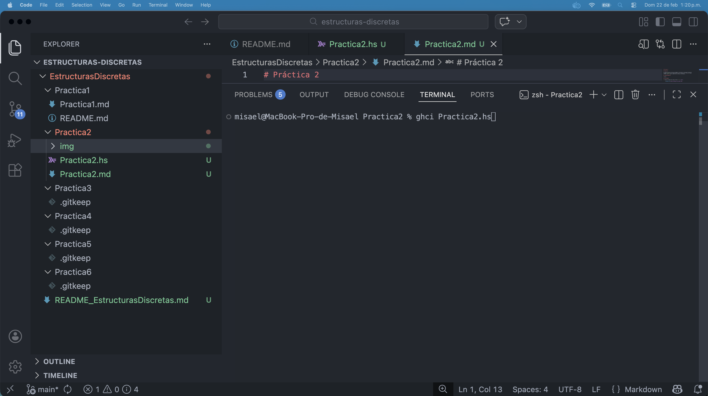
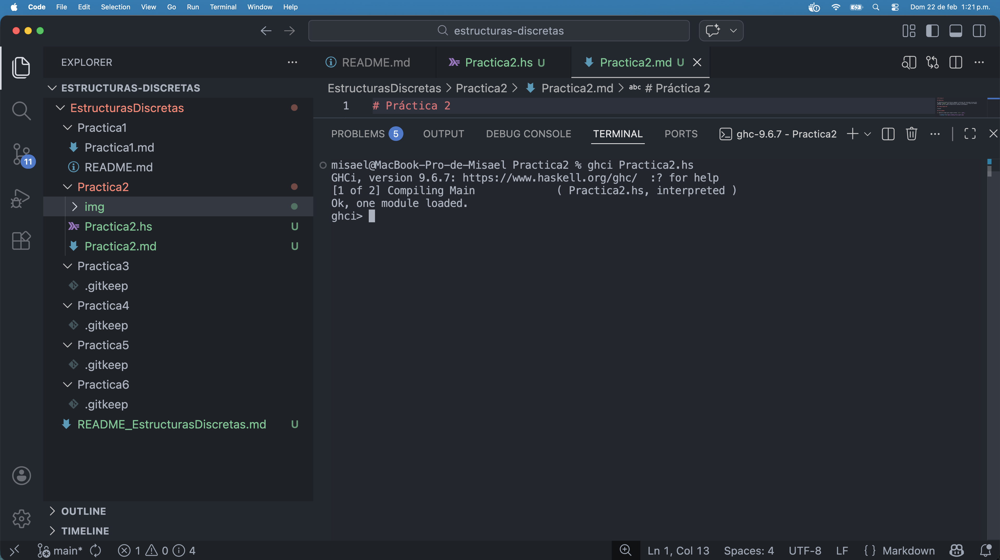

# Práctica 2

## Objetivos

El objetivo de esta práctica es empezar a utilizar las funciones básicas del
lenguaje `Haskell` para familiarizarse con la sintaxis y el flujo de trabajo
estándar que se sigue al desarrollar software utilizandolo.

## Tiempo Requerido

3 horas.

## Actividades

1. Realizar prompt para cargar archivo `.hs` a _ghci_.

    

    

2. Desafío con la función `esPar`.
    
    - ¿Cuál es la lógica detrás de tu función?
    
        Utilizando operación `AND` a nivel de bits con el número $1$, podemos
        identificar si el primero de los bits de derecha a izquierda es igual
        a `1`, pues como esa posición determina la contribución de un $2^0 = 1$
        al número en base decimal, sólo aquellos que tengan $1$ en esta posición
        van a ser números pares, todas las demás posiciones para los bits $1$
        de un número representan potencias pares de dos.

    - ¿Por qué no se puede utilizar el operador lógico `&&`?

        Al ser `Haskell` fuertemente tipado, requerimos la utilización de
        funciones especificas que manejen los datos que pasamos como entrada,
        `&&` solo puede operar con datos booleanos, mientras que `.&.` maneja
        enteros.
