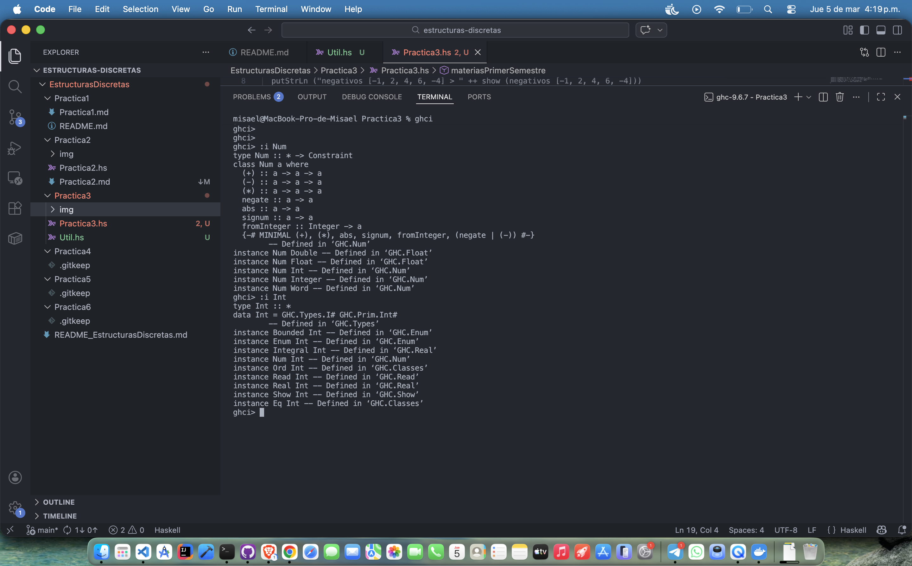
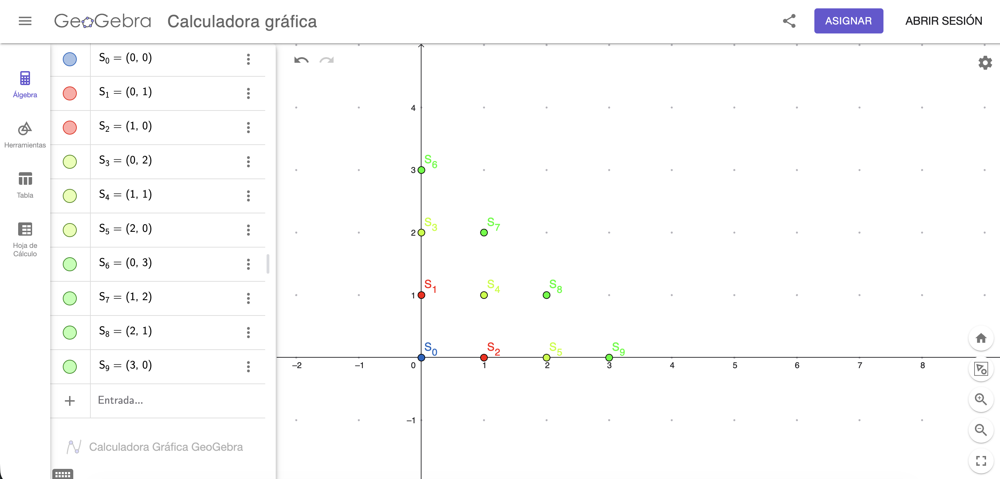

# Práctica 3

## Objetivos

El objetivo de esta práctica es agregar las listas por compresión 
a nuestro acervo de técnicas para la programación con `Haskell`, un método
declarativo para especificar los elementos que constituyen a una lista
con notación similar a la de conjuntos, común en matemáticas.

## Tiempo Requerido

3 horas.

## Actividades

1. ¿Cuál es la diferencia entre `Num` e `Int`? Realiza un ejemplo
en ghci:
    
    La principal diferencia consiste en que `Num` es una clase de tipos,
    por lo cual agrupa ciertos tratos que cada instancia de un número debe
    cumplir al implementarse, por ejemplo los operadores $+$, $-$, $*$, etc.
    
    `Int` por otro lado es un tipo de dato concreto que implementa a `Num`
    (por tanto se trata de una instancia), y con ello cuenta con sus
    propias consideraciones respecto a como se manejan los mismos, como
    un rango máximo de valores permitidos e incluso la posibilidad del
    desbordamiento.

    

2. Se necesita producir una lista infinita de todos los pares distintos
$(x, y)$ de números naturales. No importa en qué orden se enumeren los pares,
siempre que estén todos. Di si la siguiente definición hace su trabajo si
crees que no, proporciona tu propia versión y justificala:

    ```haskell
    allPairs =[( x , y ) | x <- [0..] , y <- [0..]]
    ```

    Aunque la lista parece satisfacer su propósito, la verdad es que pronto
    nos damos cuenta de las limitaciones de la misma, pues si quisiéramos
    por ejemplo verificar la existencia de un elemento, digamos el $(1,1)$
    dentro de la misma, notaríamos que se complica bastante pues primero
    se verifica dentro de todos los elementos cuya primera coordenada es
    el $0$ (los cuales son infinitos), por lo que de ahí surge la idea de
    crear una definición que permita seguir generando tuplas con todas las
    coordenadas hasta que eventualmente lleguemos a cualquier par de
    coordenadas, esto lo podemos conseguir utilizando la siguiente definición
    ubicada en el módulo `Util.hs` de nuestra práctica, pues aunque de igual
    manera obtiene los elementos conforme se van necesitando, no se salta
    ninguno (es decir que cubre todo $\mathbb{Z}^+\times\mathbb{Z}^+$)
    y no se atora en ningun punto, exceptuando si quisieramos verificar
    usando números negativos en las coordenadas, pues seguiría intentando generar números más grandes hasta completar la lista, pero ya sabemos
    que será infinita.

    

    ```haskell
    allPairs = [
        p | y <- [0..], p <- [(x, y - x) | x <- [0..y] ]]
    ```

## Recursión First Steps

- Sobre la canción _El Pollito Pío_ podemos notar que el uso de la
recursión se da al momento de repetir los pasos anteriores (el sonido de
los animales previos) hasta llegar a un caso base (esto es, el pollito pío)
pero agregando el sonido de uno nuevo al principio cada vez que se itera.
