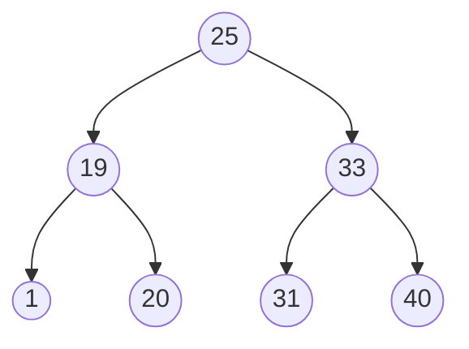
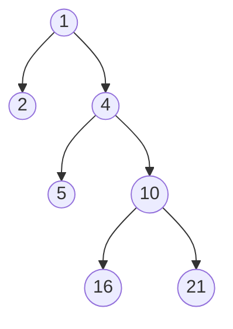

# Práctica 6

## Objetivos

Saber representar gráficamente un árbol binario, así como prcticar algoritmos
relacionados con los mismos.

## Tiempo Requerido

3 horas.

## Sintaxis

1. Árboles en Mermaid:





2. Crear representación visual de los árboles:

    - `AB 4 Vacio (AB 3 Vacio (AB 5 Vacio Vacio))`

        ```mermaid
        graph
            A((4)) --> B((Vacio))
            A --> C((3))
            C --> D((Vacio))
            C --> E((5))
            E --> F((Vacio))
            E --> G((Vacio))
        ```

    - `AB 3 (AB 7 (AB 12 Vacio Vacio) Vacio) (AB 6 (AB 11 Vacio Vacio) (AB 10 Vacio Vacio))`

        ```mermaid
        graph
            A((3)) --> B((7))
            A --> C((6))
            B --> D((12))
            B --> E((Vacio))
            C --> F((11))
            C --> G((10))
            F --> H((Vacio))
            F --> I((Vacio))
            G --> J((Vacio))
            G --> K((Vacio))
        ```

    - `AB 8 (AB 6 (AB 1 Vacio (AB 4 (AB 2 Vacio Vacio) Vacio)) (AB 7 Vacio Vacio)) (AB 15 Vacio Vacio)`

        ```mermaid
        graph
            A((8)) --> B((6))
            A --> C((15))
            B --> D((1))
            B --> E((7))
            D --> F((Vacio))
            D --> G((4))
            G --> H((2))
            G --> I((Vacio))
        ```

## Funciones

6. ¿Qué sucede cuando la lista no esta ordenada y cuando lo está?

    Si la lista está ordenada, al hacer la inserción de un elemento siempre se van
    a ir insertando en la misma dirección (ya sea el sub-árbol izquierdo o el
    derecho) de modo que al final se obtiene una especie de lista en donde la
    dirección opuesta es el arbol `Vacio` para cualquiera de los nodos.

    Ilustrando con un diagrama, al usar la lista `[1, 2, 3, 4, 5, 6, 7, 8, 9]`:

    ```mermaid
    graph
        A((1)) --> Ai((Vacio))
        A --> B((2))
        B --> Bi((Vacio))
        B --> C((3))
        C --> Ci((Vacio))
        C --> D((4))
        D --> Di((Vacio))
        D --> E((5))
        E --> Ei((Vacio))
        E --> F((6))
        F --> Fi((Vacio))
        F --> G((7))
        G --> Gi((Vacio))
        G --> H((8))
        H --> Hi((Vacio))
        H --> I((9))
    ```

    Por otro lado, si la lista no está ordenada, entonces los elementos se
    distribuyen de forma más uniforme.

    Por ejemplo al usar la lista `[5, 3, 7, 4, 6, 2, 8, 1, 9]`:

    ```mermaid
    graph
        A((5)) --> B((3))
        A --> C((7))
        B --> D((2))
        B --> E((4))
        C --> F((6))
        C --> G((8))
        G --> H((Vacio))
        G --> I((9))
        D --> J((1))
        D --> K((Vacio))
    ```

7. Consulta `arbolesHaskell_6_nota.hs` de nuestro repositorio oficial y responde a las
siguientes preguntas:
    
    - De acuerdo al ejemplo de la función `foldl` o `foldr` el árbol resultante
    es un BST balanceado?

        Obtenemos como resultado:

        ```
        AB 3 
            (AB 1 Vacio Vacio) 
            (AB 9 
                (AB 7 
                    (AB 4 Vacio (AB 6 Vacio Vacio)) 
                    (AB 8 Vacio Vacio)) 
                (AB 15 
                    (AB 12 Vacio Vacio) 
                    Vacio))
        ```

        Podemos observar que la diferencia absoluta entre las alturas de los
        sub-árboles izquierdo y derencho para cualquier nodo en el árbol es
        menor o igual que uno.

    - De manera conceptual. ¿Cuál sería la idea para que `foldr` o `foldl` nos 
    ayude a insertar BST balanceadamente?

        Podemos pensar en realizar "rotaciones" (en el sentido de que cambiamos
        de raíz de modo que las distancias a sus hojas queden mas "uniformes")
        del árbol a medida que insertamos cada nuevo nodo en el árbol acumulador
        de modo que la diferencia absoluta entre las alturas del sub-arbol
        izquierdo con el derecho de cualquier nodo sea menor o igual que 1.

    - ¿Cúales son las ventajas que tienen las funciones `foldl` sobre `foldr`?

        Algunas ventajas de utilizar `foldl` son:

        - Construye: `(((a f b) f c) f d)` de modo que si la operación es 
        asociativa a la izquierda resulta conveniente.
        
        - Cuenta con soporte nativo en su versión con recursion de cola, de
        modo que las operaciones estan optimizadas.
        
        - `foldl` necesita recorrer todo antes de dar el resultado y resulta
        conveniente al acumular valores aritmeticos o  efectuar calculos paso
        a paso.

    - ¿Cúales son las ventajas que tienen las funciones `foldr` sobre `foldl`?

        Algunos casos en los que resulta conveniente la utilización de `foldr` en 
        lugar de foldl son:
            
        - Puede detenerse antes funciona con listas infinitas (ideal para
        construir listas de forma perezosa o para hacer corto circuito 
        (detener la ejecución al obtener verdadero en un punto dado) al
        hacer evaluación de infinitas condiciones).

        - Puesto que construye: `a f (b f (c f d))`, cuando la operación que
        intentamos reducir no es asociativa, con lo que el orden en que
        efectuamos las operaciones (agrupando hacia la derecha) afecta el
        resultado final y en realidad buscamos ese orden de asociacion
        específico.

        - Resulta particularmente útil al construir estructuras.
